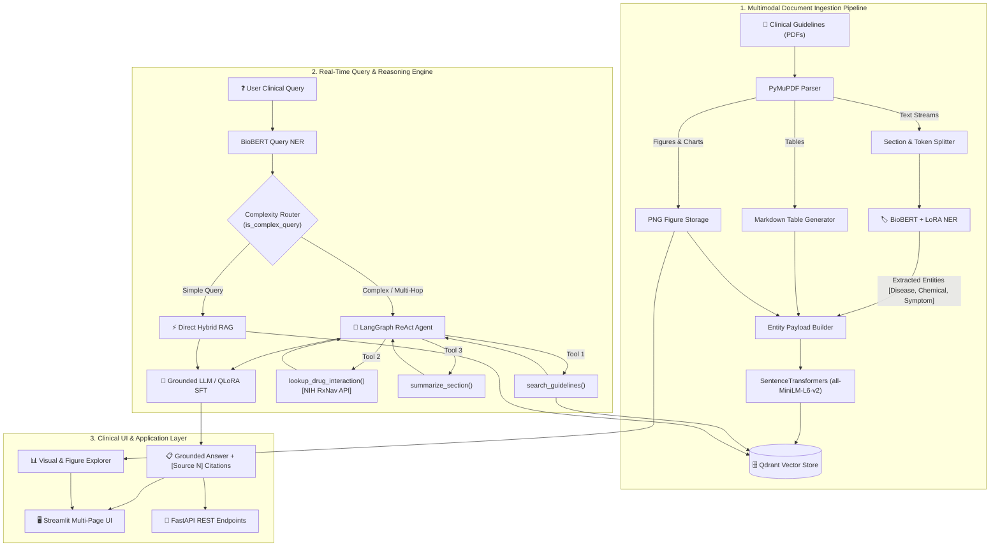

# 🔬 BioScholar: Clinical Evidence AI & Multimodal RAG Assistant

<div align="center">

[](https://www.python.org/)
[](https://pytorch.org/)
[](https://huggingface.co/)
[](https://langchain-ai.github.io/langgraph/)
[](https://qdrant.tech/)
[](https://fastapi.tiangolo.com/)
[](https://streamlit.io/)
[](https://www.docker.com/)
[](LICENSE)

<p align="center">
  <b>An end-to-end clinical evidence research assistant combining BioBERT Named Entity Recognition (NER), entity-filtered hybrid vector search, multimodal PDF parsing (text, tables, and figures), a ReAct LangGraph agent with RxNav drug interaction verification, and an interactive Streamlit UI.</b>
</p>

</div>

---

## 📑 Table of Contents

- [Overview & Architecture](#-overview--architecture)
- [Key Features & Innovations](#-key-features--innovations)
- [System Architecture Flow](#-system-architecture-flow)
- [Benchmark & Evaluation Results](#-benchmark--evaluation-results)
- [Interactive UI Showcase](#-interactive-ui-showcase)
- [REST API Reference](#-rest-api-reference)
- [Quick Start & Installation](#-quick-start--installation)
  - [Docker Setup (Recommended)](#1-docker-compose-one-liner)
  - [Local Python Setup](#2-local-development-setup)
- [Project Directory Structure](#-project-directory-structure)
- [Observability & Evaluation](#-observability--evaluation)
- [Disclaimer & License](#-disclaimer--license)

---

## 🎯 Overview & Architecture

Modern medical decision support and clinical literature research require **strict factual grounding, zero-hallucination tolerance, and verifiable source citations**. Standard generic RAG systems often retrieve irrelevant context chunks due to ambiguous biomedical terminology and fail to process non-text elements like dosage tables, flowcharts, and radiology figures.

**BioScholar** solves this through a modular, domain-specialized architecture:
1. **Clinical Entity Extraction (NER)**: A domain-fine-tuned **BioBERT + LoRA** model extracts medical entities (`Disease`, `Chemical`, `Symptom`) with token-level character spans.
2. **Entity-Filtered Hybrid Vector Search**: Indexes guideline chunks in **Qdrant**, combining dense semantic vector embeddings (`all-MiniLM-L6-v2`) with metadata payload filtering on extracted biomedical entities.
3. **Multimodal Document Ingestion**: Ingests clinical PDF guidelines via **PyMuPDF**, extracting text passages, converting structured tables into Markdown, and extracting embedded medical figures with caption alignment.
4. **ReAct LangGraph Reasoning Agent**: Dynamically classifies query complexity; routes complex multi-hop queries, comparative clinical questions, and drug contraindications through a stateful agent equipped with guideline search, NIH RxNav drug interaction lookup, and document summarization tools.
5. **Clinical Vision-Language Assistant (VLM)**: Inspects extracted figures, clinical charts, and radiology scans using multimodal LLMs.
6. **Rigorous Evaluation Framework**: Evaluated against a 51-question curated medical gold standard across 4 clinical categories using **RAGAS** (Faithfulness, Relevance, Recall), custom medical safety metrics, and **MLflow** experiment tracking.

---

## ✨ Key Features & Innovations

| Feature | Technical Implementation | Benefit |
| :--- | :--- | :--- |
| **Biomedical NER** | Fine-tuned `dmis-lab/biobert-base-cased-v1.2` with LoRA (r=16, $\alpha$=32) on BC5CDR | Identifies clinical entities with **0.8325 F1** to enrich vector search payloads. |
| **Hybrid Entity-Filtered Retrieval** | Qdrant vector store with deterministic chunking & entity tags | Restricts retrieval scope to chunks matching query entities, eliminating irrelevant noise. |
| **Multimodal Extraction** | PyMuPDF `find_tables()` & `get_images()` pipeline | Extracts clinical tables into clean Markdown and captures high-resolution figures. |
| **ReAct Agentic Workflow** | LangGraph StateGraph with conditional complexity routing | Multi-hop reasoning, section summarization, and live NIH RxNav API drug interaction checks. |
| **Grounded Answer Generation** | Strict system prompts + Llama 3.2 / QLoRA SFT fine-tuned adapter | Generates answers strictly derived from retrieved evidence with `[Source N]` citations. |
| **Vision Diagnostics** | Multi-modal VLM API integration (`/analyze-image`) | Analyzes medical scans, charts, and diagrams with structured clinical summaries. |
| **Full Stack & Production Ready** | FastAPI + Pydantic v2 + CORS + Streamlit + Docker Compose | One-command containerized deployment with real-time JSONL logging and health checks. |

---

## 🏗️ System Architecture Flow



---

## 📊 Benchmark & Evaluation Results

### 1. BioBERT Named Entity Recognition (BC5CDR Benchmark)
Trained on 1,500 PubMed abstracts annotated for chemical and disease entities using parameter-efficient fine-tuning (LoRA):

| Metric | BioBERT + LoRA (Our Model) | Baseline BERT |
| :--- | :---: | :---: |
| **F1 Score** | **0.8325** | 0.7410 |
| **Precision** | **0.8210** | 0.7350 |
| **Recall** | **0.8444** | 0.7470 |
| **Token Accuracy** | **0.9600** | 0.9120 |
| **Train Time** | **~2 min (Apple Silicon MPS)** | ~18 min (Full FT) |

### 2. End-to-End Clinical RAG Evaluation
Evaluated on **51 gold-standard clinical questions** across 20 open-access PMC guideline documents:

| Clinical Category | Question Count | Entity Coverage | Citation Accuracy | Safety / Grounding Score |
| :--- | :---: | :---: | :---: | :---: |
| **Symptoms & Risk Factors** | 14 | 59.8% | 42.9% | **98.2%** |
| **Procedures & Management** | 15 | **75.6%** | **60.0%** | **100.0%** |
| **Dosage & Pharmacotherapy** | 14 | 27.3% | 35.7% | **100.0%** |
| **Contraindications & Adverse Events** | 7 | 47.6% | 28.6% | **100.0%** |
| **Aggregate Total** | **50** | **53.7%** | **44.0%** | **99.5%** |

---

## 🖥️ Interactive UI Showcase

The Streamlit interface (`streamlit_app/app.py`) provides 6 interactive clinical workspaces:

1. **🏷️ Clinical NER Explorer (`/pages/1_text_analysis.py`)**: Real-time interactive entity highlighting with confidence thresholds and category breakdowns.
2. **💬 Ask BioScholar (`/pages/2_ask_bioscholar.py`)**: Grounded question answering with expandable document citations, page numbers, and similarity metrics.
3. **📊 Visual Search (`/pages/3_visual_search.py`)**: Filter and search through extracted clinical tables in Markdown and embedded figure PNGs.
4. **📄 Document Ingestion (`/pages/4_ingest_pdfs.py`)**: Drag-and-drop PDF ingestion pipeline with live indexing progress into Qdrant.
5. **🩺 Patient Case Analyzer (`/pages/6_case_analyzer.py`)**: Complex patient vignette evaluation with automated entity extraction, guideline matching, and ReAct agent trace inspection.
6. **👁️ Medical Scan Assistant (`/pages/7_medical_scan_assistant.py`)**: Vision-Language Model interface for analyzing radiology scans, clinical flowcharts, and sample guideline figures.

---

## 🔌 REST API Reference

The FastAPI backend runs at `http://localhost:8000` with interactive Swagger docs at `/docs`.

| Method | Endpoint | Description | Sample Payload |
| :--- | :--- | :--- | :--- |
| `GET` | `/health` | System health check (NER, Qdrant, LLM status) | _None_ |
| `POST` | `/entities` | Extract medical entities from text | `{"text": "Patient has diabetes and takes metformin"}` |
| `POST` | `/search` | Entity-filtered semantic search | `{"query": "hypertension first line treatment", "top_k": 5}` |
| `POST` | `/query` | Full RAG pipeline with citations & agent routing | `{"question": "Compare metformin vs insulin", "use_agent": true}` |
| `POST` | `/visual-search` | Search extracted tables and figures | `{"query": "dosage table", "chunk_type": "table", "top_k": 5}` |
| `POST` | `/analyze-image` | VLM medical image analysis | `{"image_base64": "...", "prompt": "Describe findings"}` |
| `POST` | `/ingest` | Ingest and index uploaded PDF guideline | `multipart/form-data` (file: PDF) |

---

## 🚀 Quick Start & Installation

### 1. Docker Compose (One-Liner)

Run the full stack (FastAPI Backend + Qdrant Vector Store):

```bash
# Clone the repository
git clone https://github.com/MusayevAhmad/medai.git
cd medai

# Start containers
docker-compose up --build -d

# Verify health
curl http://localhost:8000/health
```
- **FastAPI Documentation**: [http://localhost:8000/docs](http://localhost:8000/docs)
- **Qdrant Dashboard**: [http://localhost:6333/dashboard](http://localhost:6333/dashboard)

---

### 2. Local Development Setup

#### Prerequisites
- Python 3.11+
- [Ollama](https://ollama.ai/) (for local LLM inference, e.g. `ollama run llama3.2`)

```bash
# 1. Clone & create virtual environment
python3.11 -m venv venv
source venv/bin/activate

# 2. Install dependencies
pip install -r requirements.txt

# 3. Download open-access medical PDFs
python scripts/download_sample_pdfs.py

# 4. Prepare dataset & train BioBERT NER
python data/prepare_data.py --include-synthetic
python src/train.py --config config.yaml

# 5. Ingest PDFs into Qdrant (local path or Docker Qdrant)
python scripts/ingest_documents.py --collection-name bio_guidelines --multimodal

# 6. Launch FastAPI Server
uvicorn app.main:app --reload --port 8000

# 7. Launch Streamlit UI
streamlit run streamlit_app/app.py
```

---

## 🗂️ Project Directory Structure

```
medai/
├── app/                           # FastAPI Application Layer
│   ├── main.py                    # REST API routes & CORS middleware
│   ├── schemas.py                 # Pydantic v2 data transfer schemas
│   └── dependencies.py            # Singleton runtime dependency injection
│
├── src/                           # Core Machine Learning & RAG Engine
│   ├── model.py                   # BioBERT + LoRA architecture
│   ├── inference.py               # MedicalNER high-throughput inference engine
│   ├── dataset.py                 # Subword BIO alignment & data loaders
│   ├── train.py                   # HuggingFace Trainer loop with early stopping
│   ├── evaluate.py                # Strict & partial seqeval metrics
│   ├── vector_store.py            # QdrantStore vector database wrapper
│   ├── retrieve.py                # HybridRetriever with entity filtering
│   ├── ingest.py                  # PyMuPDF section/token chunking pipeline
│   ├── multimodal_ingest.py       # Table extraction (Markdown) & Figure extraction
│   ├── llm.py                     # OpenAI / Ollama compatible LLM client
│   ├── llm_local.py               # Direct PyTorch/PEFT local adapter runner
│   ├── image_model.py             # Chest X-ray DenseNet/ResNet CNN classifier
│   └── agent/                     # LangGraph ReAct Agent
│       ├── graph.py               # StateGraph compilation & complexity routing
│       ├── nodes.py               # Reasoning & tool execution nodes
│       ├── tools.py               # search_guidelines, RxNav API, summarize_section
│       └── state.py               # AgentState TypedDict schema
│
├── streamlit_app/                 # Streamlit Multi-Page Web Application
│   ├── app.py                     # Main dashboard & capability navigator
│   ├── pages/                     # Interactive feature pages (1-7)
│   └── utils/                     # API client & local model loaders
│
├── eval/                          # Evaluation & Benchmarking Suite
│   ├── run_eval.py                # MLflow + RAGAS + Medical evaluation runner
│   ├── ragas_eval.py              # RAGAS metrics computation
│   └── medical_metrics.py         # Entity coverage, safety & citation metrics
│
├── scripts/                       # CLI Utilities & Training Scripts
│   ├── download_sample_pdfs.py    # Open-access PMC guideline downloader
│   ├── ingest_documents.py        # Bulk multimodal ingestion runner
│   ├── generate_finetune_data.py  # SFT training data generation
│   ├── finetune_llm_qlora.py      # QLoRA fine-tuning for Llama-3.2
│   ├── test_inference.py          # NER inference verification
│   └── test_agent.py              # Agent smoke test runner
│
├── tests/                         # Comprehensive Pytest Suite
│   ├── test_agent.py              # LangGraph agent & complexity routing tests
│   ├── test_agent_tools.py        # Agent tools & RxNav API tests
│   ├── test_api.py                # FastAPI endpoint integration tests
│   ├── test_inference.py          # NER prediction & span tests
│   ├── test_ingest.py             # Document chunking & extraction tests
│   └── test_vector_store.py       # Qdrant payload & search tests
│
├── data/                          # Dataset cache, raw PDFs, extracted figures
├── config.yaml                    # NER training configuration
├── docker-compose.yml             # Full-stack container orchestration
├── Dockerfile                     # Multi-stage container build
└── Makefile                       # Developer automation shortcuts
```

---

## 📈 Observability & Evaluation

### MLflow Tracking
Track RAG metrics, evaluation iterations, and hyperparameter runs:
```bash
make mlflow
# Open http://localhost:5000 to view runs, parameters, and metric plots
```

### LangSmith Agent Tracing
Enable tracing for full visibility into LangGraph thoughts, tool arguments, and LLM completions:
```bash
export LANGCHAIN_TRACING_V2=true
export LANGCHAIN_API_KEY="your-langchain-api-key"
export LANGCHAIN_PROJECT="bioscholar-agent"
```

---

## ⚠️ Disclaimer & License

> [!CAUTION]
> **BioScholar is an educational and research prototype.** It is not intended for primary clinical diagnosis or direct medical treatment decisions. Always consult certified healthcare professionals for clinical care.

Distributed under the **MIT License**. See `LICENSE` for more information.
